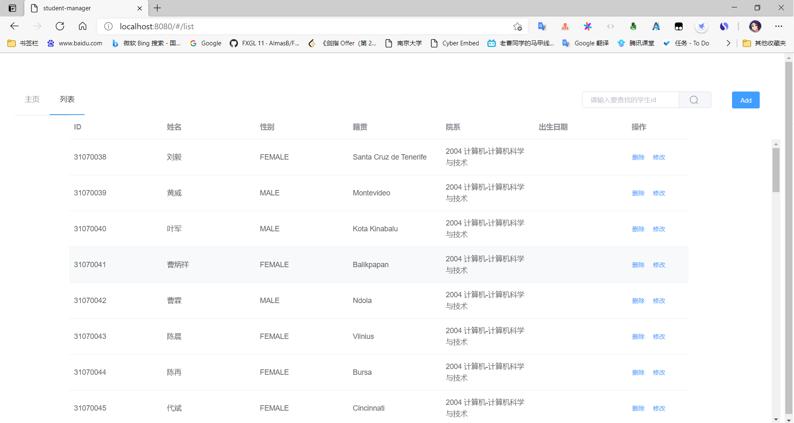
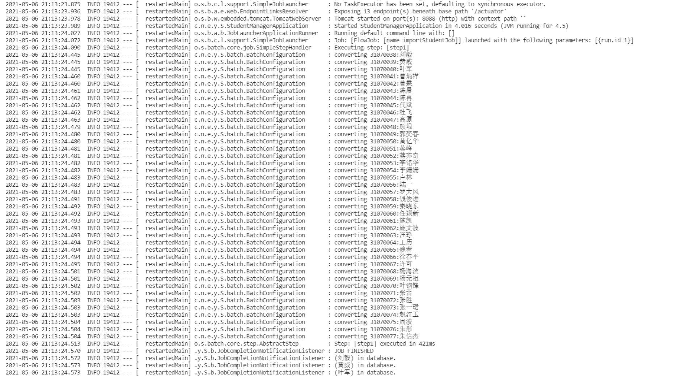

# StudentManager

homework description : [here](https://github.com/njuics/sa-2021/wiki/%E4%BD%9C%E4%B8%9A)

## 进度说明

- 参考[spring-petclinic](https://github.com/spring-projects/spring-petclinic)的MVC架构模式完成学生管理应用[0.1](https://github.com/youngstudent2/StudentManager/releases/tag/0.1)，实现学生信息（姓名、性别、出生年月、籍贯、院系、学号）管理（增删改查）
- 打包为docker容器，并使用haproxy搭建了水平扩展系统，使用redis缓存，使用gatling进行压力测试，见[SoftwareArchitecture](https://github.com/youngstudent2/SoftwareArchitecture)
- 参考 https://spring.io/guides/tutorials/rest/ ，将学⽣管理应⽤改为REST风格，并将StudentManager前后端分离，前端项目见[此处](https://github.com/youngstudent2/StudentManager-front)

## 仓库说明

此仓库仅为学生管理应用的spring boot代码

历史版本见[此处](https://github.com/youngstudent2/StudentManager/releases)

### Spring Batch读取学生信息的Excel文件

**结果截图**

网页截图

控制台截图

### 遇到的问题

日志导致spring boot应用不断重启：

- 原因是在Batch中使用的日志工具引起了项目文件的改变，触发了devtools的热更新
- 在配置中加上`spring.devtools.restart.enabled=false`禁用热更新即可

